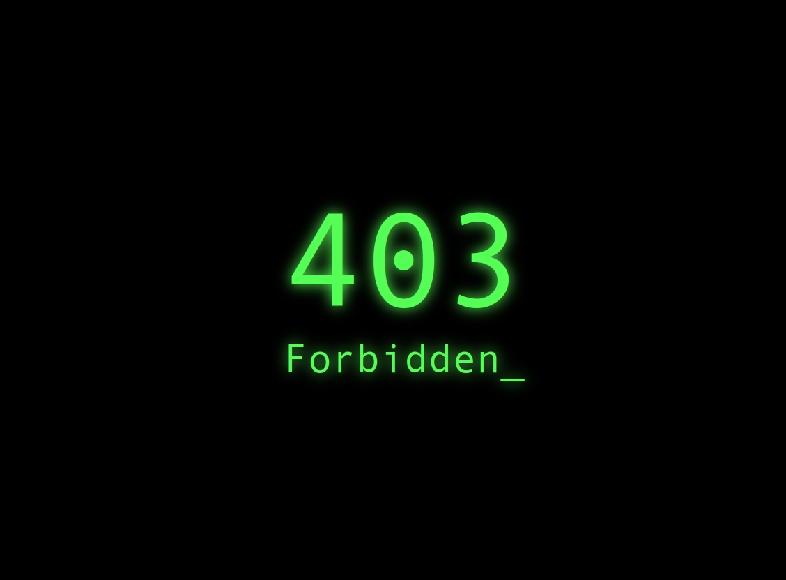

# Simple Caddy Error Messages

## About

This repo includes basic Caddy (Caddyserver) configs for using simple custom 4xx/5xx error message pages. 

Error pages are self-contained single-file pages with CSS and HTML. No outside dependencies. System fonts are assumed -- no callouts to Google Font APIs needed (for speed and privacy!).

Includes pages for:

- 403 Forbidden
- 404 Not Found
- 500 Internal Server Error
- Generic Error
- 200 Success placeholder page for testing or whatever

Template Caddyfile includes:

- Sample site config for `domain.tld` (replace with your own!)
- Cloudflare DNS-based TLS configuration
- Snippet for the error handling
    - 403 --> 403.html
    - 404 --> 404.html
    - 500 --> 500.html
    - Any other error code 400-599 --> error.html
- Snippet for keeping a site network-local (returns 403 outside private IP ranges)

Repo also includes a script to install a customized Caddy build that includes the Cloudflare-DNS plugin.

## Screenshots

### 403 Forbidden

### 404 Not Found

### 500 Internal Server Error

### Generic Error

### 200 Success

## Author

**Mike Owens**

- Website:  [michaelowens.me](https://michaelowens.me)
- GitHub:   [@qu13t0ne](https://github.com/qu13t0ne)
- GitLab:   [@qu13t0ne](https://gitlab.com/qu13t0ne)
- Mastodon: [@qu13t0ne@infosec.exchange](https://infosec.exchange/@qu13t0ne)
- X (Twitter):  [@quietmike8192](https://x.com/qu13t0ne)

## Acknowledgments

- Error pages modified from [lsgrrd/403](https://codepen.io/lsgrrd/pen/BObbYY)

## License

**[MIT](LICENSE) © Mike Owens**
